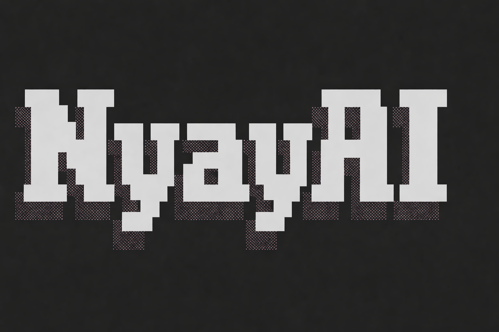
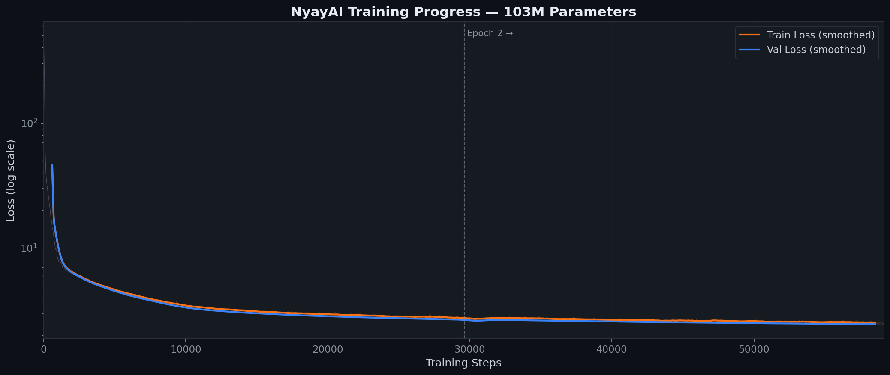
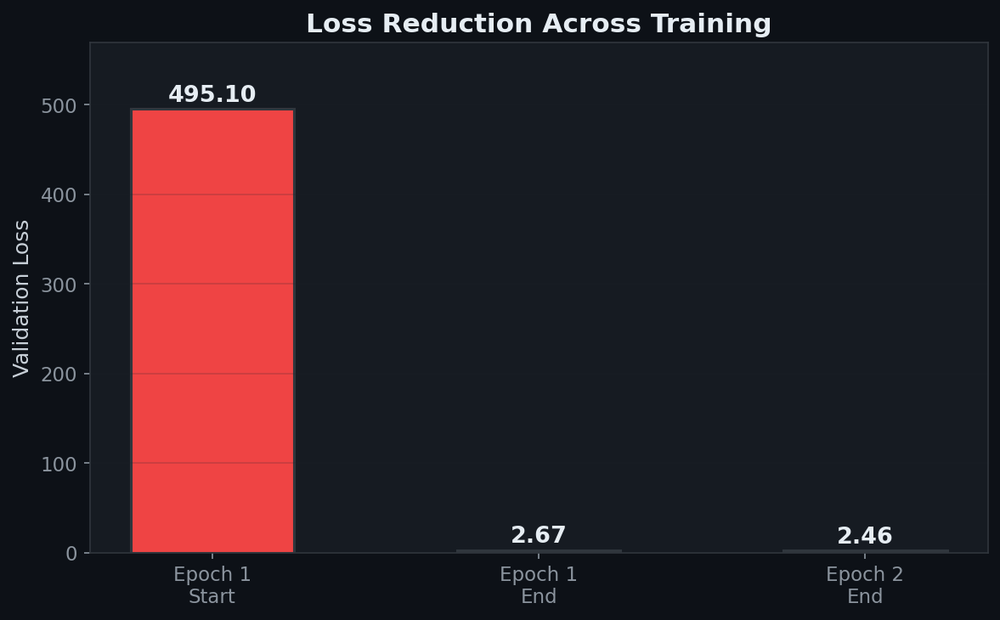
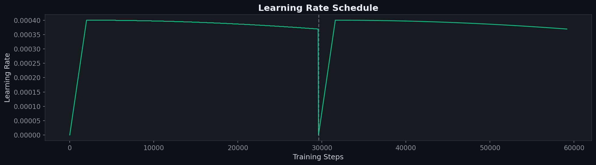

<![CDATA[<p align="center">
  
</p>

<h1 align="center">NyayAI — 103M Parameter Legal Foundation Model</h1>

<p align="center">
  <b>A GPT-style Language Model Trained from Scratch on Indian Legal Data</b>
</p>

<p align="center">
  
  
  
  
  
</p>

---

NyayAI is a custom-built GPT-style language model trained **entirely from scratch** on 269 million tokens of Indian Supreme Court and High Court judgments. No pre-trained weights, no fine-tuning — every parameter was learned from raw legal text.

---

## 🎯 The Problem

India's legal system faces a staggering backlog of over **5 crore pending cases**. Legal research, case analysis, and document drafting remain extremely time-intensive. Access to justice is delayed for millions.

## 💡 The Solution

NyayAI is a foundational step toward AI-assisted legal intelligence. It's a **specialist model** — built from the ground up to understand and generate text in the language and structure of Indian law.

This repository contains the **complete, end-to-end pipeline**: raw data processing → tokenization → model architecture → distributed GPU training → local inference → web UI.

---

## ✨ Key Highlights

- **Built from scratch** — Custom GPT architecture implemented in PyTorch, no HuggingFace dependencies
- **103M parameters** — 9-layer transformer with 12 attention heads and 768-dim embeddings
- **269M training tokens** — 1.25 GB of cleaned Indian legal judgments (Supreme Court + High Courts)
- **Weight tying** — Token embedding weights shared with output head, reducing parameter count
- **Cosine LR schedule** — Warmup + cosine decay for stable training
- **Fault-tolerant training** — Per-epoch checkpointing with auto-download and resumable training
- **Runs locally** — Fast CPU inference (~10 tokens/sec), no GPU needed for generation
- **Web interface** — Dark-themed premium UI with generation controls

---

## 📊 Training Results

### Full Training Curve (Log Scale)

The model's loss dropped from **495 → 2.46** across 2 epochs of training on ~59K gradient steps.

<p align="center">
  
</p>

### Epoch 2 — Fine-Tuning Phase

After the dramatic initial learning in Epoch 1, Epoch 2 shows steady refinement as the model learns subtler legal patterns. Val loss: **2.67 → 2.46** (perplexity: 14.4 → 11.7).

<p align="center">
  
</p>

### Loss Reduction Summary

<p align="center">
  
</p>

| Epoch | Train Loss | Val Loss | Perplexity | Time      |
|-------|-----------|----------|------------|-----------|
| 1     | 2.760     | 2.674    | 14.50      | 3.7 hours |
| 2     | 2.540     | 2.460    | 11.70      | 3.5 hours |

> **Training paused after 2 epochs** ($30 compute budget spent). Will resume epochs 3-5 next month. The loss curve is still trending downward — more improvement expected.

### Learning Rate Schedule

Cosine decay with linear warmup. Note the warmup reset at epoch 2 boundary (a known behavior during resume).

<p align="center">
  
</p>

---

## 🧠 Model Architecture

```
Input Tokens
    ↓
Token Embedding (50,257 × 768) + Positional Embedding (512 × 768)
    ↓
┌─────────────────────────────────────┐
│  Transformer Block (×9)              │
│  ├── LayerNorm                       │
│  ├── Multi-Head Attention (12 heads) │
│  │   ├── Q, K, V projections (768)   │
│  │   ├── Causal mask                 │
│  │   └── Output projection          │
│  ├── Residual connection + Dropout   │
│  ├── LayerNorm                       │
│  ├── Feed-Forward (768 → 3072 → 768) │
│  └── Residual connection + Dropout   │
└─────────────────────────────────────┘
    ↓
Final LayerNorm
    ↓
Output Head (weight-tied with Token Embedding)
    ↓
Logits (50,257)
```

| Parameter           | Value                           |
| ------------------- | ------------------------------- |
| Vocabulary Size     | 50,257 (GPT-2 BPE via tiktoken) |
| Context Length      | 512 tokens                      |
| Embedding Dimension | 768                             |
| Attention Heads     | 12 (head dim = 64)              |
| Transformer Layers  | 9                               |
| Feed-Forward Hidden | 3,072 (4× emb_dim)              |
| Dropout Rate        | 0.1                             |
| Total Parameters    | **102,762,240 (~103M)**         |
| Model Size (FP32)   | **392 MB**                      |
| Weight Tying        | Yes (tok_emb ↔ out_head)        |

---

## ⚙️ Training Configuration

### Infrastructure

| Component         | Details                                            |
| ----------------- | -------------------------------------------------- |
| GPU               | NVIDIA A100 (40 GB) via [Modal](https://modal.com) |
| Framework         | PyTorch 2.x                                        |
| Tokenizer         | tiktoken (GPT-2 BPE, 50,257 tokens)                |
| Training Platform | Modal (serverless GPU cloud)                       |

### Hyperparameters

| Setting                 | Value                                     |
| ----------------------- | ----------------------------------------- |
| Batch Size              | 8,192 tokens (context_length × batch)     |
| Total Training Tokens   | 269,098,817 (~269M)                       |
| Train/Val Split         | 90% / 10%                                 |
| Train Batches per Epoch | 29,564                                    |
| Optimizer               | AdamW (β1=0.9, β2=0.99, ε=1e-8, wd=0.1)   |
| Peak Learning Rate      | 4e-4                                      |
| Min Learning Rate       | 4e-5                                      |
| LR Schedule             | Linear warmup (2000 steps) → Cosine decay |
| Gradient Clipping       | 1.0 (global norm)                         |
| Target Epochs           | 5 (2 completed)                           |

### Fault-Tolerant Training Features

- **Per-epoch checkpointing** — Model + optimizer state saved after every epoch
- **Auto-download** — Checkpoints automatically downloaded from cloud to local machine
- **Resumable training** — Pass `--resume-from` flag to continue from any checkpoint
- **Per-epoch logs** — Training metrics saved as JSON after each epoch (no data loss on interruption)
- **Generator pattern** — `remote_gen()` streams results to client as epochs complete

---

## 📂 Project Structure

```
NyayAI/
│
├── llm_engine.py              # GPT model architecture (Transformer, MHA, FFN)
├── data_loader.py             # Dataset/DataLoader (chunked tokenization)
├── data_cleaner.py            # Raw legal text cleaning pipeline
├── training.py                # Modal-based distributed training script
├── count_params.py            # Parameter counting utility
├── plot_training.py           # Matplotlib visualisation generator
│
├── infer.py                   # Local inference engine (standalone or importable)
├── app.py                     # Flask web server
├── templates/
│   └── index.html             # Dark-themed web interface
│
├── IMG/                       # Training plots & assets
│   ├── nyayAI.png             # Logo
│   ├── training_loss_full.png # Full training curve (log scale)
│   ├── epoch2_loss.png        # Epoch 2 zoom
│   ├── loss_comparison.png    # Bar chart comparison
│   └── lr_schedule.png        # Learning rate schedule
│
├── checkpoints/               # Model checkpoints (not in git)
│   ├── epoch_1_model_and_optimizer.pth
│   ├── epoch_2_model_and_optimizer.pth
│   ├── training_log_epoch_1.json
│   └── training_log_epoch_2.json
│
├── data/                      # Training corpus
│   └── combined_legal_data.txt
│
├── logs/                      # Raw training logs
│   ├── epoch_1_logs.txt
│   └── epoch_2_logs.txt
│
├── requirements.txt
└── README.md
```

---

## 🚀 Quick Start

### 1. Install Dependencies

```bash
git clone https://github.com/AshishRaj04/NyayAI-100M-Parameter-Legal-Foundation-Model.git
cd NyayAI-100M-Parameter-Legal-Foundation-Model

python -m venv .venv
.venv\Scripts\activate       # Windows
# source .venv/bin/activate  # Linux/Mac

pip install -r requirements.txt
```

### 2. Run Inference (CLI)

```bash
python infer.py --prompt "The verdict of the court is " --max-tokens 200
```

### 3. Run Web Server

```bash
python app.py
# Open http://localhost:5000
```

### 4. Train the Model (requires Modal account)

```bash
# First time - full training
modal run training.py --num-epochs 5 --eval-freq 50 --eval-iter 5

# Resume from checkpoint
modal run training.py --num-epochs 5 --resume-from runs/<run-id>/epoch_2_model_and_optimizer.pth
```

---

## 📈 Sample Outputs

**Prompt:** `Under Section 498A of the Indian Penal Code,`

**Generated (Epoch 1, Val Loss 2.67):**

> Under Section 498A of the Indian Penal Code, as per the document, the charge under Section 376 IPC was based on the complaint, which was filed by the appellant before the trial court.

**Prompt:** `The verdict of the court is`

**Generated (Epoch 2, Val Loss 2.46):**

> The verdict of the court is that the appellant has failed to prove that the order of the trial court is based on the evidence on record and the observations made by the High Court.

> _Note: After 2 epochs, the model generates grammatically correct legal English and understands court terminology. Section-specific accuracy improves with further training._

---

## 🛠️ Tech Stack

| Layer                   | Technology                  |
| ----------------------- | --------------------------- |
| Model Architecture      | Custom GPT (PyTorch)        |
| Tokenizer               | tiktoken (GPT-2 BPE)        |
| Training Infrastructure | Modal (serverless A100 GPU) |
| Inference               | PyTorch (CPU)               |
| Web Backend             | Flask                       |
| Web Frontend            | Vanilla HTML/CSS/JS         |
| Data                    | 1.25 GB Indian legal corpus |

---

## 🔮 Roadmap

- [x] Custom GPT architecture from scratch
- [x] 103M parameter model training
- [x] Per-epoch checkpointing & resumable training
- [x] Local CPU inference engine
- [x] Web interface with generation controls
- [x] Epoch 1-2 training complete (val loss: 2.46)
- [x] Training visualisation & analysis plots
- [ ] Complete 5-epoch training (epochs 3-5)
- [ ] RAG integration for grounded legal answers
- [ ] Fine-tuning for instruction-following
- [ ] Deployment to production

---

## 👨‍💻 Author

**Ashish Raj**

Built as a proof-of-concept for AI-powered legal intelligence in India.

---

## 📄 License

This project is for educational and research purposes. The training data consists of publicly available Indian court judgments.
]]>
